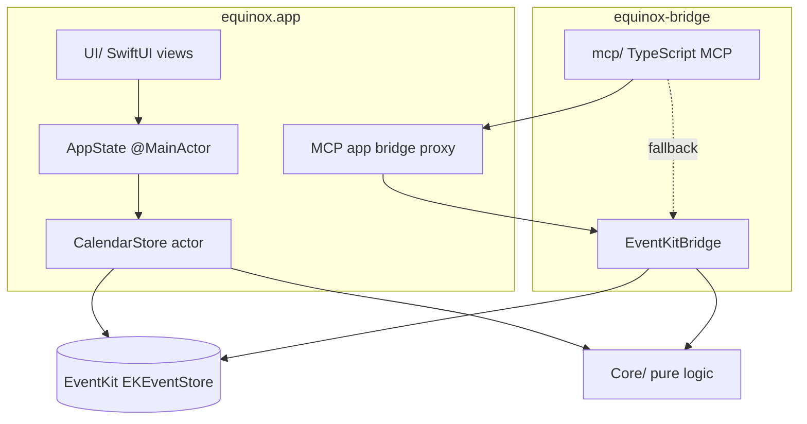
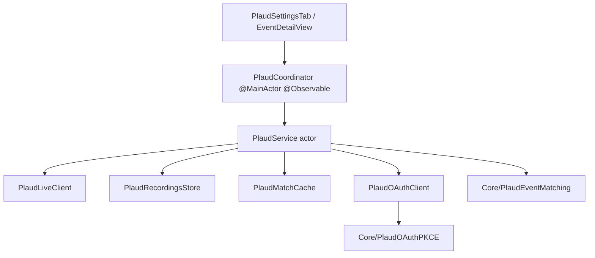

# Архитектура

## Обзор

equinox — это menu bar приложение, построенное как гибрид **AppKit-оболочки и SwiftUI-панелей**. Бизнес-логика живёт в `Core/`; доступ к EventKit ограничен двумя адаптерами:

## Продуктовые поверхности

| Поверхность | Пользовательские возможности |
|-------------|------------------------------|
| Menu bar panel | Месячная сетка, agenda, выбор дня, навигация по месяцам, Today, popover/pinned panel |
| Event sheets | Создание события с датой/временем, all-day, календарём, location, URL, notes, recurrence и alert; просмотр деталей; удаление writable событий; RSVP |
| Settings | General, Calendars, Appearance, Privacy, Shortcuts, MCP, Plaud, About |
| Menu bar icon | Дата/день недели/месяц/часы, скрытая иконка, meeting indicator |
| Plaud | OAuth, refresh локального каталога, auto-match прошедших встреч, manual link, Open in Plaud |
| Calendar MCP | 13 инструментов для доступа, CRUD событий, аналитики расписания и read-only Plaud-кэша; prompts и resources для AI-клиентов |

## Слои

| Слой | Путь | Ответственность |
|------|------|-----------------|
| App | `equinox/App/` | Жизненный цикл, `AppState`, `EventsCoordinator`, `PanelPresentationState`, `PlaudCoordinator`, константы, defaults |
| Core | `equinox/Core/` | Даты, сетка, лейаут, распознавание join URL, RSVP mapping, Plaud matching, Plaud PKCE/timestamp parsing |
| Services | `equinox/Services/` | Шлюз к EventKit (`CalendarStore`), настройки, Plaud service/cache/OAuth, платформенные хелперы, общий EventKit-маппинг (`EventKitCalendarMapping` — app+bridge) |
| UI | `equinox/UI/` | SwiftUI-презентация; получает `AppState` + `SizeMetrics`; не ходит в EventKit напрямую |
| bridge | `bridge/` | Headless JSON CLI поверх EventKit: access, calendars, events CRUD |
| mcp | `mcp/` | MCP-инструменты, Zod-входы, prompts/resources, аналитика расписания, read-only Plaud cache adapter |

**Правило:** UI никогда не обращается к `EKEventStore` напрямую. MCP никогда не обращается к EventKit напрямую. Минимальная версия macOS — **26.0**; доступ к календарю использует только full-access API EventKit (`.fullAccess`, `requestFullAccessToEvents`).

## Состояние и уведомления

- `AppState` — `@Observable @MainActor`; composition root: `EventsCoordinator`, `PanelPresentationState`, `PanelLayoutMetrics`, `PlaudCoordinator`
- `PreferencesStore.shared` — персистентные настройки (`k*`-ключи в `Constants.swift`)
- `CalendarStore` — `actor`; единственный шлюз к EventKit в GUI
- Синхронизация событий: `EventsCoordinator.syncFromCalendarStore()` подтягивает снимки из `CalendarStore` после fetch/мутации/смены выбора календарей/выдачи доступа и внешних изменений EventKit (без NotificationCenter)
- Уведомления (только menu bar / appearance, не данные календаря):
  - `kEquinoxSizePreferenceChanged` — размер панели S/M/L
  - `kEquinoxMenuBarAppearanceChanged` — перерисовка иконки menu bar

## Различия поведения app и bridge

Задокументированные различия (намеренные; не выравнивать без явной задачи):

| Поведение | GUI (`CalendarStore`) | Bridge/MCP |
|-----------|----------------------|------------|
| Отклонённые приглашения | Показываются, dimmed в agenda | Отфильтрованы в `list_events`; `get_event` → `not_found` |
| Join URL | Web + переписывание на нативное приложение, если установлено | Только web URL (`JoinURLDetection`) |
| Многодневные события | Day-слоты `EventLayout` в сетке/agenda | Одно плоское событие на вхождение |
| Фильтр календарей | `CalendarSelectionStorage` + Настройки | Все календари, если не передан `calendarIds` |
| RSVP | `setParticipationStatus` в GUI (`EventRSVPBar`) | Команды нет |
| Редактирование события | Не поддерживается в GUI | `update_event` в MCP |
| TCC vocabulary | `CalendarAccessStatus.authorized` (legacy alias) | `full_access` / `write_only` в JSON bridge |
| `create_event` поля | recurrence, alarms, timezone (GUI-only) | title, dates, calendar, allDay, location, notes, url |
| `delete_event` span | Только `thisEvent` | `thisEvent` (default) или `futureEvents` |
| Plaud | OAuth, refresh, auto/manual match, open recording | Bridge ничего не знает о Plaud; MCP дополняет события из локального кэша |

## Calendar MCP

MCP-сервер регистрирует:

- **Tools:** `get_calendar_access_status`, `request_calendar_access`, `list_calendars`, `list_events`, `get_event`, `create_event`, `update_event`, `delete_event`, `analyze_schedule`, `find_conflicts`, `find_free_time`, `get_plaud_status`, `list_plaud_recordings`.
- **Prompts:** `daily_agenda`, `weekly_calendar_review`.
- **Resources:** `equinox://docs/calendar`, `equinox://schema/event`.

`list_events` и `get_event` по умолчанию дополняют события полями `hasPlaudRecording` и `plaudRecording`, если в локальном Plaud-кэше Equinox есть привязка. Это MCP-level enrichment: `equinox-bridge` возвращает только EventKit-данные.

## Ключевые потоки

**Создание события (GUI):** `NewEventSheet` → `NewEventDraft` → `AppState.createEvent` → `CalendarStore.createEvent` → EventKit

**Загрузка событий:** видимый диапазон сетки/agenda → `AppState.updateVisibleRange` → `CalendarStore.fetchEvents` → `EventsCoordinator.syncFromCalendarStore()` подтягивает снимки `DayEvent`

**RSVP (GUI):** `EventDetailView` → `EventRSVPBar` → `AppState.setParticipationStatus` → `EventsCoordinator` → `CalendarStore.setParticipationStatus` → EventKit (KVC `participationStatus`; только приглашения с участниками)

**Удаление события (GUI):** `EventDetailView` → `AppState.deleteEvent` → `CalendarStore.deleteEvent` (span: `thisEvent`)

**MCP list events:** инструмент → `invokeBridge({ command: "list_events", ... })` → локальный app bridge proxy в запущенном `equinox.app` → `equinox-bridge` → EventKit. Если приложение не запущено, MCP пробует прямой fallback на `equinox-bridge`, который может быть заблокирован TCC у AI-клиента без Calendar entitlement.

**Deep link:** `equinox://date/yyyy-MM-dd` → `AppDelegate.application(_:open:)` → `AppState` навигация на дату

**MCP Plaud enrichment:** `list_events` / `get_event` → bridge EventKit events → `attachPlaudRecordingsToEvents()` → локальные `plaud-recordings.json` и `plaud-match-cache.json` → добавление read-only полей Plaud к JSON-событиям

## Подсистема Plaud

Интеграция с Plaud (записи встреч) — отдельная подсистема GUI. MCP не ходит в Plaud API и не читает Keychain; он только читает локальный кэш, который обновляет приложение.

- **Coordinator** — UI-facing состояние в `equinox/App/PlaudCoordinator.swift`: ссылки на события, refresh/history match, OAuth для settings
- **Service (actor)** — оркестрация match, cache, OAuth tokens, live API
- **Core** — чистая логика match (`PlaudEventMatching`), PKCE (`PlaudOAuthPKCE`), timestamp parsing (`PlaudTimestamp`)
- **Настройки:** вкладка Plaud (`PlaudSettingsTab`), флаг `kPlaudEnabled` в `PreferencesStore`
- **Хранилище:** локальные JSON-снимки каталога записей и match cache в Application Support; OAuth tokens — в Keychain
- **Privacy:** вкладка `PrivacySettingsTab` — статус TCC для app (и bridge через MCP settings)

## Settings tabs

General, Calendars, Appearance, **Privacy**, Shortcuts, About, MCP, **Plaud** — см. `SettingsTab` в `equinox/App/SettingsTab.swift`.

## Тесты

- `equinoxTests/` — unit-тесты Core и Services (без живого EventKit в unit-тестах)
- `mcp/test/` — bridge envelope, Zod-схемы, аналитика, Plaud-кэш
- Интеграционные/ручные — TCC, create/delete, выбор календарей

См. [AGENTS.md](AGENTS.md) §9 для матрицы «изменение → тест».
