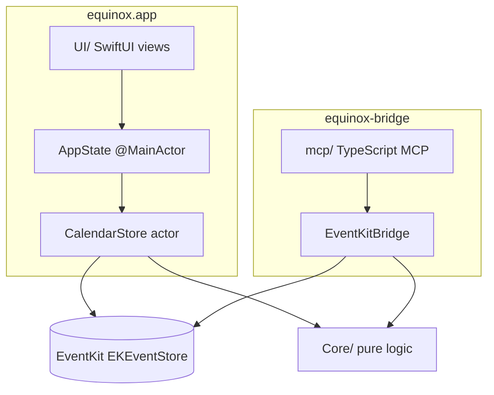

# Архитектура

## Обзор

equinox — это menu bar приложение, построенное как гибрид **AppKit-оболочки и SwiftUI-панелей**. Бизнес-логика живёт в `Core/`; доступ к EventKit ограничен двумя адаптерами:

## Слои

| Слой | Путь | Ответственность |
|------|------|-----------------|
| App | `equinox/App/` | Жизненный цикл, `AppState`, константы, `registerDefaults()` |
| Core | `equinox/Core/` | Даты, сетка, лейаут, распознавание join URL, маппинг RSVP |
| Services | `equinox/Services/` | Шлюз к EventKit (`CalendarStore`), настройки, платформенные хелперы |
| UI | `equinox/UI/` | SwiftUI-презентация; получает `AppState` + `SizeMetrics` |
| bridge | `bridge/` | Headless JSON CLI поверх EventKit |
| mcp | `mcp/` | MCP-инструменты, валидация Zod, аналитика расписания |

**Правило:** UI никогда не обращается к `EKEventStore` напрямую. MCP никогда не обращается к EventKit напрямую. Минимальная версия macOS — **26.0**; доступ к календарю использует только full-access API EventKit (`.fullAccess`, `requestFullAccessToEvents`).

## Состояние и уведомления

- `AppState` — `@Observable @MainActor`; навигация, кэш событий, фасад над `CalendarStore`
- `PreferencesStore.shared` — персистентные настройки (`k*`-ключи в `Constants.swift`)
- `CalendarStore` — `actor`; единственный шлюз к EventKit в GUI
- Уведомления:
  - `kEquinoxEventsUpdated` — данные календаря изменились; AppState перезапрашивает
  - `kEquinoxSizePreferenceChanged` — размер панели S/M/L
  - `kEquinoxMenuBarAppearanceChanged` — перерисовка иконки menu bar

## Различия поведения app и bridge

Задокументированные различия (намеренные; не выравнивать без явной задачи):

| Поведение | GUI (`CalendarStore`) | Bridge/MCP |
|-----------|----------------------|------------|
| Отклонённые приглашения | Показываются, dimmed в agenda | Отфильтрованы в `list_events`; `get_event` → `not_found` |
| Join URL | Web + переписывание на нативное приложение, если установлено | Только web URL (`JoinURLDetection`) |
| Многодневные события | Day-слоты `EventLayout` в сетке/agenda | Одно плоское событие на вхождение |
| Фильтр календарей | `CalendarSelectionStorage` + Настройки | Все календари, если не передан `calendarIds` |
| RSVP | `setParticipationStatus` в GUI | Команды нет |
| Редактирование события | Не поддерживается в GUI | `update_event` в MCP |

## Ключевые потоки

**Создание события (GUI):** `NewEventSheet` → `NewEventDraft` → `AppState.createEvent` → `CalendarStore.createEvent` → EventKit

**Загрузка событий:** видимый диапазон сетки/agenda → `AppState.updateVisibleRange` → `CalendarStore.fetchEvents` → снимки `DayEvent` → `kEquinoxEventsUpdated`

**MCP list events:** инструмент → `invokeBridge({ command: "list_events", ... })` → `equinox-bridge` → EventKit

## Тесты

- `equinoxTests/` — unit-тесты Core и Services (без живого EventKit в unit-тестах)
- `mcp/test/` — разбор envelope bridge, аналитика
- Интеграционные/ручные — TCC, create/delete, выбор календарей

См. [AGENTS.md](AGENTS.md) §9 для матрицы «изменение → тест».
