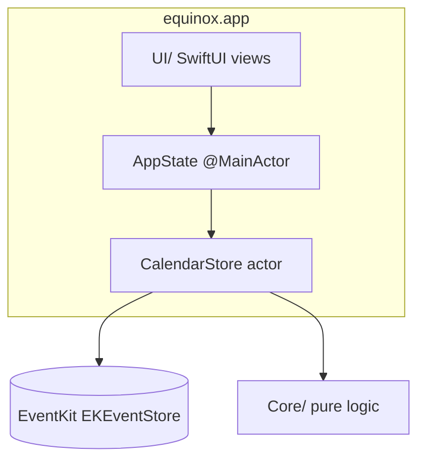

# Архитектура

## Обзор

equinox — это menu bar приложение, построенное как гибрид **AppKit-оболочки и SwiftUI-панелей**. Бизнес-логика живёт в `Core/`; единственный шлюз к EventKit — `CalendarStore`:

```mermaid
flowchart TB
    subgraph gui [equinox.app]
        UI[UI/ SwiftUI views]
        AppState[AppState @MainActor]
        CalendarStore[CalendarStore actor]
    end
    EK[(EventKit EKEventStore)]
    Core[Core/ pure logic]

    UI --> AppState
    AppState --> CalendarStore
    CalendarStore --> EK
    CalendarStore --> Core
```

## Продуктовые поверхности

| Поверхность | Пользовательские возможности |
|-------------|------------------------------|
| Menu bar panel | Месячная сетка, agenda, выбор дня, навигация по месяцам, Today, popover/pinned panel |
| Event drawer | Создание события с датой/временем, all-day, календарём, location, URL, notes, recurrence и alert; просмотр деталей; удаление writable событий; read-only RSVP-статус |
| Settings | General, Calendars, Appearance, Privacy, Shortcuts, About |
| Menu bar icon | Дата/день недели/месяц/часы, скрытая иконка, meeting indicator |

## Сборочные модули

`equinox.app` содержит только SwiftUI-точку входа и подключает `EquinoxKit.framework`.
`EquinoxKit` объединяет существующие слои и ресурсы. Единственный открытый наружу
тип — `AppDelegate`; внутренние модели и координаторы не становятся публичным API.
Framework встраивается в Release-приложение; bundle ID и владелец TCC не меняются.

Обычные XCTest импортируют `EquinoxKit` через `@testable` и не имеют `TEST_HOST`.
Графические XCTest используют `equinoxGraphicsHost`, где нет AppDelegate,
CalendarStore и запроса разрешений. Все targets используют сборочную модель Xcode;
ручной второй компиляции Swift нет.

## Слои

| Слой | Путь | Ответственность |
|------|------|-----------------|
| App | `equinox/App/` | Жизненный цикл, `AppState`, `EventsCoordinator`, `PanelPresentationState`, константы, defaults |
| Core | `equinox/Core/` | Даты, сетка, лейаут, реестр meeting-провайдеров и распознавание join URL, RSVP status mapping |
| Services | `equinox/Services/` | Шлюз к EventKit (`CalendarStore`), настройки, платформенные хелперы и EventKit-маппинг |
| UI | `equinox/UI/` | SwiftUI-презентация; получает `AppState` + `SizeMetrics`; не ходит в EventKit напрямую |

**Правило:** UI никогда не обращается к `EKEventStore` напрямую. Минимальная версия macOS — **26.0**; доступ к календарю использует только full-access API EventKit (`.fullAccess`, `requestFullAccessToEvents`).

## Состояние и уведомления

- `AppState` — `@Observable @MainActor`; composition root: `EventsCoordinator`, `PanelPresentationState`, `PanelLayoutMetrics`
- `PreferencesStore.shared` — персистентные настройки (`k*`-ключи в `Constants.swift`)
- `CalendarStore` — `actor`; единственный шлюз к EventKit
- Синхронизация событий: `EventsCoordinator.syncFromCalendarStore()` получает единый `CalendarStoreSnapshot: Sendable` из actor после fetch/мутации/смены выбора календарей/выдачи доступа и внешних изменений EventKit. Снимок применяется без промежуточных `await`; запоздалые ответы синхронизации отбрасываются.
- `CalendarEventStore` в `Services/CalendarEventStore.swift` — контракт для подстановки сервиса в тестах; рабочая реализация — `CalendarStore`. Поколение кэша инвалидирует незавершённую обработку при изменении данных, выбора, доступа или временного контекста. Длинные запросы разбиваются на части до 366 дней, чтобы не попасть под четырёхлетнее ограничение EventKit.
- Уведомления (только menu bar / appearance, не данные календаря):
  - `kEquinoxSizePreferenceChanged` — размер панели S/M/L
  - `kEquinoxMenuBarAppearanceChanged` — перерисовка иконки menu bar

## UI access patterns

`AppState` — composition root. Паттерн доступа из SwiftUI:

| Действие | Куда обращаться |
|----------|----------------|
| Мутации: create/delete event, calendar selection, navigate+present | `AppState` facade (`createEvent`, `deleteEvent`, `selectDate`, `goToToday`, …) |
| Чтение/биндинг: `monthDate`, `selectedDate`, `eventsByDate`, loading flags | `appState.events` (`EventsCoordinator`) |
| Pin/popover, panel chrome | `appState.panel` (`PanelPresentationState`) |
| Персистентные настройки | `appState.preferences` (`PreferencesStore.shared`) |

Навигация по датам/месяцам вынесена в `CalendarNavigationCoordinator`; `EventsCoordinator` делегирует и re-export'ит flat API (`monthDate`, `selectDate`, …) без изменения call sites.

## Ключевые потоки

Формы создания и просмотра события раскрываются слева внутри того же окна. Высота календаря сохраняется; длинная форма прокручивается. Стрелка сворачивает форму, Escape сначала закрывает календарь выбора даты, затем форму. Основной календарь временно недоступен, пока форма открыта; во время сохранения/удаления закрытие заблокировано. Подтверждение удаления остаётся отдельным sheet.

**Создание события (GUI):** `NewEventSheet` → `NewEventDraft` → `AppState.createEvent` → `CalendarStore.createEvent` → EventKit

**Загрузка событий:** видимый диапазон сетки/agenda → `EventsCoordinator.updateVisibleRange` / `updateAgendaVisibleRange` → `EventFetchCoordinator` → `CalendarStore.fetchEvents` → `EventsCoordinator.syncFromCalendarStore()` подтягивает снимки `DayEvent`

**RSVP (GUI):** статус текущего пользователя читается из публичного `EKParticipant.participantStatus` и показывается без возможности изменения. EventKit не предоставляет публичный API для ответа на приглашение.

**Удаление события (GUI):** `EventDetailView` → `AppState.deleteEvent` → `CalendarStore.deleteEvent`. `EventsCoordinator` объединяет одновременные запросы для одного идентификатора и начала повторения до завершения обновления данных; разные повторения остаются независимыми, после ошибки доступен повторный запрос. Удаляется выбранное повторение (`thisEvent`). Для последнего дня всех конечных правил применяется эквивалентное усечение (`futureEvents`), чтобы EventKit macOS не восстановил ранее исключённые даты. Чистая проверка границ — `isFinalRecurrenceDay`; отделённые повторения и правила без даты окончания этот путь не используют.

**Deep link:** `equinox://date/yyyy-MM-dd` → `AppDelegate.application(_:open:)` → `AppState` навигация на дату

## Settings tabs

General, Calendars, Appearance, **Privacy**, Shortcuts, About — см. `SettingsTab` в `equinox/App/SettingsTab.swift`.

## Зависимости и тестируемость

- `AppState` завершает регистрацию календарного обработчика и первый снимок в одной
  задаче инициализации. `AppDelegate` ждёт её перед запросом разрешения.
- Сброс настроек использует внедрённый `PreferencesStore` и операции сброса shortcut /
  автозапуска. Состояние видимости закреплённой панели хранится там же.
- `LoadingIndicatorController` принимает монотонное время и отложенный вызов.
  Пересекающиеся запросы сохраняют исходный срок показа, отменённые действия
  отбрасываются по поколению.
- `CalendarSelectionService.refresh(calendars:)` принимает снимок значений;
  `refresh(from:)` адаптирует EventKit к этому контракту.
- `NewEventDraft` и ошибки находятся в `Core`; валидация не импортирует EventKit.
- `Bundle.equinox` явно выбирает ресурсы библиотеки, в том числе в тестах.

## Тесты

- `equinoxTests/` — чистая логика, координаторы, настройки и несохраняемые объекты адаптера EventKit
- `equinoxGraphicsTests/` — компоновка и рендеры с синтетическими данными
- Интеграционные/ручные — TCC, create/delete, выбор календарей

См. [AGENTS.md](AGENTS.md) §7 для матрицы «изменение → тест».
