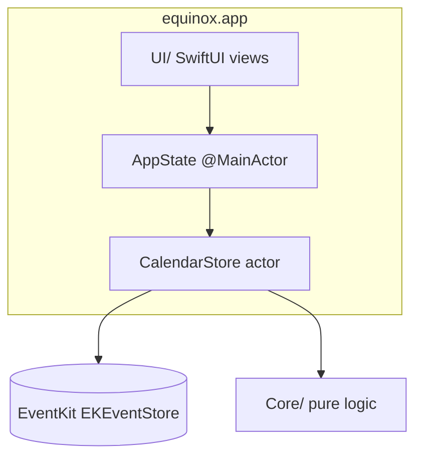

# Архитектура

## Обзор

equinox — это menu bar приложение, построенное как гибрид **AppKit-оболочки и SwiftUI-панелей**. Бизнес-логика живёт в `Core/`; единственный шлюз к EventKit — `CalendarStore`:

```mermaid
flowchart TB
    subgraph gui [equinox.app]
        UI[UI/ SwiftUI views]
        AppState[AppState @MainActor]
        CalendarStore[CalendarStore actor]
    end
    EK[(EventKit EKEventStore)]
    Core[Core/ pure logic]

    UI --> AppState
    AppState --> CalendarStore
    CalendarStore --> EK
    CalendarStore --> Core
```

## Продуктовые поверхности

| Поверхность | Пользовательские возможности |
|-------------|------------------------------|
| Menu bar panel | Месячная сетка, agenda, выбор дня, навигация по месяцам, Today, popover/pinned panel |
| Event sheets | Создание события с датой/временем, all-day, календарём, location, URL, notes, recurrence и alert; просмотр деталей; удаление writable событий; read-only RSVP-статус |
| Settings | General, Calendars, Appearance, Privacy, Shortcuts, About |
| Menu bar icon | Дата/день недели/месяц/часы, скрытая иконка, meeting indicator |

## Слои

| Слой | Путь | Ответственность |
|------|------|-----------------|
| App | `equinox/App/` | Жизненный цикл, `AppState`, `EventsCoordinator`, `PanelPresentationState`, константы, defaults |
| Core | `equinox/Core/` | Даты, сетка, лейаут, реестр meeting-провайдеров и распознавание join URL, RSVP status mapping |
| Services | `equinox/Services/` | Шлюз к EventKit (`CalendarStore`), настройки, платформенные хелперы и EventKit-маппинг |
| UI | `equinox/UI/` | SwiftUI-презентация; получает `AppState` + `SizeMetrics`; не ходит в EventKit напрямую |

**Правило:** UI никогда не обращается к `EKEventStore` напрямую. Минимальная версия macOS — **26.0**; доступ к календарю использует только full-access API EventKit (`.fullAccess`, `requestFullAccessToEvents`).

## Состояние и уведомления

- `AppState` — `@Observable @MainActor`; composition root: `EventsCoordinator`, `PanelPresentationState`, `PanelLayoutMetrics`
- `PreferencesStore.shared` — персистентные настройки (`k*`-ключи в `Constants.swift`)
- `CalendarStore` — `actor`; единственный шлюз к EventKit
- Синхронизация событий: `EventsCoordinator.syncFromCalendarStore()` подтягивает снимки из `CalendarStore` после fetch/мутации/смены выбора календарей/выдачи доступа и внешних изменений EventKit (без NotificationCenter)
- Уведомления (только menu bar / appearance, не данные календаря):
  - `kEquinoxSizePreferenceChanged` — размер панели S/M/L
  - `kEquinoxMenuBarAppearanceChanged` — перерисовка иконки menu bar

## UI access patterns

`AppState` — composition root. Паттерн доступа из SwiftUI:

| Действие | Куда обращаться |
|----------|----------------|
| Мутации: create/delete event, calendar selection, navigate+present | `AppState` facade (`createEvent`, `deleteEvent`, `selectDate`, `goToToday`, …) |
| Чтение/биндинг: `monthDate`, `selectedDate`, `eventsByDate`, loading flags | `appState.events` (`EventsCoordinator`) |
| Pin/popover, panel chrome | `appState.panel` (`PanelPresentationState`) |
| Персистентные настройки | `appState.preferences` (`PreferencesStore.shared`) |

Навигация по датам/месяцам вынесена в `CalendarNavigationCoordinator`; `EventsCoordinator` делегирует и re-export'ит flat API (`monthDate`, `selectDate`, …) без изменения call sites.

## Ключевые потоки

**Создание события (GUI):** `NewEventSheet` → `NewEventDraft` → `AppState.createEvent` → `CalendarStore.createEvent` → EventKit

**Загрузка событий:** видимый диапазон сетки/agenda → `EventsCoordinator.updateVisibleRange` / `updateAgendaVisibleRange` → `EventFetchCoordinator` → `CalendarStore.fetchEvents` → `EventsCoordinator.syncFromCalendarStore()` подтягивает снимки `DayEvent`

**RSVP (GUI):** статус текущего пользователя читается из публичного `EKParticipant.participantStatus` и показывается без возможности изменения. EventKit не предоставляет публичный API для ответа на приглашение.

**Удаление события (GUI):** `EventDetailView` → `AppState.deleteEvent` → `CalendarStore.deleteEvent` (span: `thisEvent`)

**Deep link:** `equinox://date/yyyy-MM-dd` → `AppDelegate.application(_:open:)` → `AppState` навигация на дату

## Settings tabs

General, Calendars, Appearance, **Privacy**, Shortcuts, About — см. `SettingsTab` в `equinox/App/SettingsTab.swift`.

## Тесты

- `equinoxTests/` — unit-тесты Core и Services (без живого EventKit в unit-тестах)
- Интеграционные/ручные — TCC, create/delete, выбор календарей

См. [AGENTS.md](AGENTS.md) §7 для матрицы «изменение → тест».
