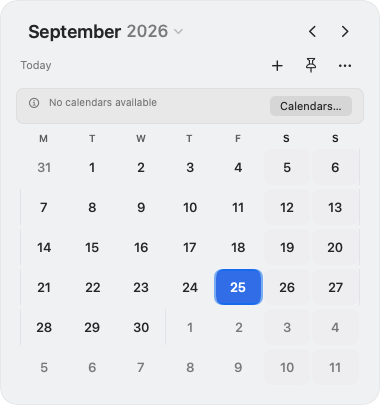
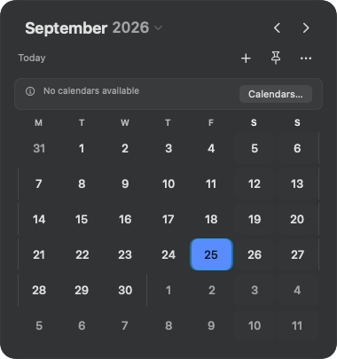

# Equinox: повторная проверка 26 сентября 2026

Повторный проход начат с `97e5d87`, после первого аудита и изменения ручки боковой панели. Найдены и исправлены пять дополнительных проблем. Автоматические проверки, сборка Release и повторный живой прогон выполнены. Публикация ожидает авторизации: в Xcode → Apple Accounts нет учётной записи; пользователю открыто окно входа.

## Подтверждённые проблемы

| Сценарий | До исправления | Исправление и доказательство |
| --- | --- | --- |
| Повторный выбор той же даты в осенний переход времени | Второе 01:30 в Лос-Анджелесе 1 ноября 2026 превращалось в первое 01:30, сдвигая событие на час; терялись и доли секунды | При выборе прежнего дня сохраняется исходный момент времени. Новый тест падал в `run-3jN7Qu`, все 35 тестов дат формы прошли в `run-79SIqh` |
| Повторное удаление при медленной загрузке | Уже удалённая строка ещё видна, повторный запрос возвращает «Событие не найдено» | Координатор объединяет одновременные удаления одной пары «идентификатор + начало повторения», включая ожидание загрузки. Другие повторения независимы, после ошибки доступна новая попытка. Воспроизведение: `run-HOXESs`; регрессионные проверки проходят |
| Бледные дни недели и номера недель | Контраст существующего токена на непрозрачной поверхности: 2,04:1 в светлом и 3,17:1 в тёмном режиме | Сохранены существующие токены и непрозрачность, основа изменена на основной цвет текста. Графическая проверка контраста теперь проходит в обоих режимах |
| Бледный текст ошибок и предупреждений | Семь из восьми сочетаний error/warning × card/filled × light/dark не проходили проверку читаемости текста; особенно слабым был оранжевый текст на светлом фоне | Основной цвет текста используется для сообщения, цветные значок и фон сохраняются. Проверка реального рендера падает до изменения (`run-WRqWlo`) и проходит после |
| Цвет выбранной вкладки настроек | В живом светлом интерфейсе название и значок выбранной вкладки оставались тёмными на синем выделении | Убран принудительный foreground у системного Label. Система теперь задаёт цвет для выбранного/обычного состояния. Исправление проверено в живых светлом и тёмном окнах; снимки до/после ниже |

Для небольших подписей выбран ориентир 4,5:1 из [WCAG 2.2, Contrast Minimum](https://www.w3.org/WAI/WCAG22/Understanding/contrast-minimum.html). Эти измерения относятся к проверенным компонентам и фонам, а не подтверждают полную доступность приложения или контраст glass поверх любого рабочего стола.

Дополнительно исправлен пробел в проверках локализации: графический host не разрешал локализацию встроенного framework, поэтому прежний запуск с `-testLanguage ru` оставлял строки английскими. Host теперь использует то же `CFBundleAllowMixedLocalizations`, что и настоящее приложение. Регрессионная проверка сравнивает фактическую строку с запрошенным языком; русский интерфейс повторно отрисован и просмотрен. Настройки подписи проекта не менялись.

## Пройденные этапы

1. **Календарь и agenda.** Повторно проверены арифметика всех поддержанных дней 1583–3333, високосные годы, границы месяцев, сетка с разным началом недели, синхронизация выбора и прокрутки, «Сегодня», быстрые переходы и большие наборы событий. Автоматические проверки проходят. В живой панели проверены загрузка календаря «Из почты» и синхронное появление/исчезновение тестового события в сетке и agenda.
2. **Создание и выбор даты.** Проверены невалидные интервалы и URL, all-day, DST, предельные даты, длительность при переносе, все поддержанные повторы и напоминания через Core и несохранённые объекты EventKit. Исправлен сдвиг времени при повторном выборе даты. Формы отрисованы в S/M/L, glass/solid, light/dark.
3. **Просмотр и удаление.** Проверены текущий экземпляр повторения, ошибки сервиса, медленное обновление, независимые экземпляры серии, отказ доступа и обновление сведений внешним снимком. Исправлено повторное удаление во время загрузки. В живом Release создано одноразовое all-day событие «Equinox QA 20260926 — round 2» в «Из почты»: сведения показывают один день 26 сентября; удаление через подтверждение возвращает число событий к нулю. Личные события не изменялись. Ранее созданных QA-событий на 27/28 сентября и 5/6/7 октября также нет.
4. **Панель и настройки.** Проверены геометрия раскрытия и сворачивания, сохранение высоты, правого края и согласованность окна с содержимым, шесть вкладок настроек, персистентность значений, восстановление сочетаний клавиш и состояния записи. Живой повторный проход: все шесть вкладок, светлая/тёмная/системная тема, десять полных циклов открытия/сворачивания, 12 переходов по месяцам и возврат «Сегодня». Escape сначала закрывает выбор даты, затем форму, оставляя календарь открытым. За серию циклов RSS изменился с 91 264 до 92 848 KiB; в покое CPU 0%. Это короткая проверка устойчивости, не доказательство отсутствия всех утечек. Календарный фильтр и системная тема восстановлены. Физические клики по краям значка menu bar и внешний экран повторно не проверены.
5. **Доступ, загрузка и интеграции.** Повторены тесты всех состояний разрешений, пустых данных, ошибки/повтора, устаревшего ответа, смены фильтра, системных уведомлений, корректных и ошибочных deep links, распознавания meeting URL и выбора обработчика. Это проверки подставного хранилища и адаптеров; живой вызов внешнего обработчика в этой итерации не выполнялся.
6. **Выпуск.** Release собран и запущен штатным `run.sh` с существующей подписью Developer ID. Временная локальная конфигурация подписи восстановлена. После разблокировки живой прогон выполнен. Загрузка в TestFlight в предыдущей итерации остановилась на `Failed to Use Accounts`; проверка Xcode показала пустой список Apple Accounts, пользователю открыто окно входа.

## Проверки

- Исходный повторный Debug-прогон: 371 обычный тест, 0 ошибок и пропусков (`run-zGEyAq`).
- Итоговый `scripts/test.sh`: **374 обычных + 14 графических тестов в Debug и Release — 776 выполнений, 0 ошибок и пропусков** (`run-tNivlw`). Предыдущие полные прогоны также прошли (`run-g8Ooq6`, `run-5nu3D7`, `run-sY33U6`).
- Address Sanitizer и Thread Sanitizer: в каждом режиме 374 обычных и 14 графических тестов, без ошибок, пропусков и runtime warnings в xcresult. Повторный русский графический прогон с проверкой фактического языка: 14 тестов, 0 ошибок и пропусков (`graphics-ru-verified.xcresult`).
- Заключительный статический анализ Release: `ANALYZE SUCCEEDED`; локальная Release-сборка: `BUILD SUCCEEDED`. Предупреждений компилятора в собственном коде нет; остаётся сообщение Xcode об отсутствии необязательной зависимости AppIntents при извлечении метаданных.
- Логи, xcresult и снимки этого прохода: `build/DeepQA/2026-09-26-round-two`; полные прогоны: `build/Tests/results`.

## Сравнения интерфейса

Это свежие рендеры рабочих SwiftUI-компонентов из XCTest с синтетическими данными. Они сохранены и просмотрены в этом проходе; снимками живого календаря пользователя они не являются.

| Компонент | До | После |
| --- | --- | --- |
| Светлый календарь |  |  |
| Тёмный календарь |  |  |
| Предупреждение |  |  |

Русские формы: [маленькая панель создания](docs/qa/2026-09-26-round-two/drawer-ru-small-light.png), [настройки оформления](docs/qa/2026-09-26-round-two/settings-ru-light.png). В offscreen-снимке настроек системная область выделения строки выглядит чёрной, поэтому этот снимок не использовался как доказательство исправления цвета.

Живые снимки настроек без личных событий: [светлая тема до](docs/qa/2026-09-26-round-two/sidebar-before-light.png), [после](docs/qa/2026-09-26-round-two/sidebar-after-light.png), [тёмная тема после](docs/qa/2026-09-26-round-two/sidebar-after-dark.png). Цвет выбранной вкладки подтверждён именно в живом окне.

В логах изолированного графического host остаются сообщения системных служб linkd, StatusBar и однократное предупреждение AppKit о вложенном layout. Проверки геометрии и диагностика потоков проходят; источник предупреждения layout без живой диагностики не подтверждён.

## Что остаётся

- Восстановить временное закрепление панели после проверки установки TestFlight. Календарный фильтр, тема и контроль удаления тестовых событий восстановлены/проверены.
- Восстановить авторизацию Xcode для существующей команды H23ADBVT65. App Store Connect повторно проверен: последняя сборка — 1.0.0 (4), номер 5 свободен.
- Собрать новый архив из итогового `main`: архив первого прохода не содержит исправлений этого отчёта и не должен загружаться.
- Загрузить архив, дождаться обработки, проверить установку через внутреннюю группу, добавить сборку в существующую внешнюю группу Equinox и пройти Beta App Review, если потребуется.
- Подтвердить новую версию по [публичной ссылке TestFlight](https://testflight.apple.com/join/N2t7wjvr). Сейчас обновлённая бета **не опубликована**, ожидание проверки Apple ещё не началось.

Живого прогона на macOS 26 нет; согласованное ранее исключение сохраняется. Среда автоматических проверок: macOS 27.0 (26A428), arm64, Xcode 27.0 (27A266a). Исправления не меняют bundle ID, ключи настроек, deep links и настройки подписи проекта; новые зависимости не добавлены.
